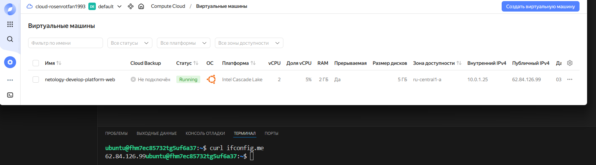
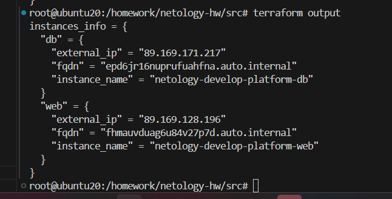

Репа домашних заданий netology

hw-02 Задания:
1.4 Поменял платформу региона на standard-v2, standard-v4 не походил по минимальным требования характеристики вм. И заменил переменную ssh ключа т.к для авторизации достаточно открытого а не закрытого ключа.
1.6 preemptible = true (прерываемая вм) core_fraction=5(Гарантированная доля vCPU) Все это нужно для снижения расходов на содержание вм.

