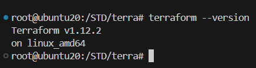
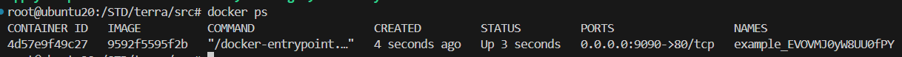
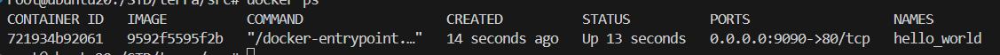

Задания:
1.2 *.tfstate *.tfstate.*

1.3 "result": "EVOVMJ0yW8UU0fPY"

1.4 -> Строка (resource "docker_image") нужно добавить имя ресурса, ниже оно задано как (image = docker_image.nginx) исправленная строка 
    (resource "docker_image" "nginx")
    -> Строка (resource "docker_container" "1nginx") имена ресурсов нельзя начинать с цыфры (resource "docker_container" "nginx")
    -> Строка (name  = "example_${random_password.random_string_FAKE.resulT}") Ошибки в (random_string_FAKE) нет такого поля, есть (random_string)
    и ошибка в (.resulT) правильно result

6   -> Опасность ключа -auto-approve(немедленное выполнение) в том что могут быть изменения связанные с удалением ресурсов(возможен риск 
    безвозвратной потери данных) не говоря уже о том что мы перед применением должны ознакомиться с изменениями нового аплая что-бы 
    понимать что делаем.